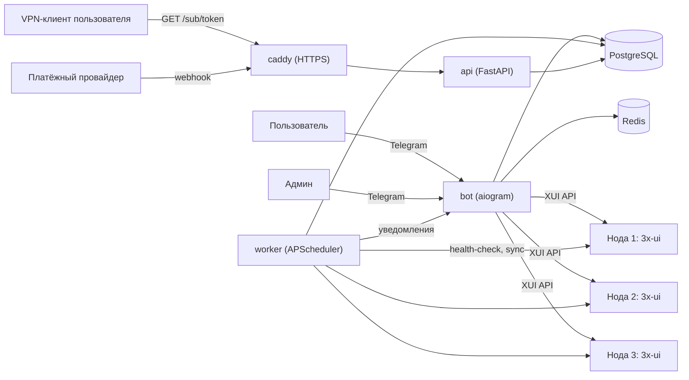

# VPN Shop Bot

Приватный VPN-сервис на базе **3x-ui** (VLESS + Reality) с несколькими
серверами в одной подписке и Telegram-ботом для продаж, поддержки и
администрирования.

> Приватный проект. Открытой лицензии нет — все права защищены.

## ⚠️ Дисклеймер

- Проверьте условия использования (ToS) вашего хостинг/VPS-провайдера —
  часть провайдеров ограничивает использование сервера как VPN-для-перепродажи.
- Продажа доступа к VPN регулируется по-разному в разных юрисдикциях —
  это не юридическая консультация, при масштабировании в реальный бизнес
  свяжитесь с юристом.
- Приём платежей: многие эквайринговые провайдеры отдельно оговаривают в
  оферте категорию «VPN/анонимайзеры» — уточняйте у выбранного провайдера
  до интеграции.

## Возможности

- 🔒 VLESS + Reality — не требует TLS-сертификата, маскируется под обычный
  HTTPS к реальному сайту, устойчив к DPI-блокировкам лучше классического TLS.
- 🌍 Несколько серверов в одной подписке: `GET /sub/{token}` отдаёт сразу
  все доступные конфиги, клиент выбирает сервер сам; плюс кнопки «Автовыбор»
  и «Выбрать сервер конкретно» прямо в боте.
- 📈 Лёгкое масштабирование: новая нода добавляется мастером в боте и сразу
  автоматически раздаётся всем действующим подписчикам.
- 💳 Тарифы (1/3/12 мес., безлимитный трафик), пробный период, история
  платежей, бонусный реферальный баланс — всё редактируется из бота.
- 💳 Оплата: интерфейс провайдера абстрагирован — из коробки работает
  `manual` (ручное подтверждение админом) и полностью реализована `yookassa`;
  переключение — одна переменная в `.env`.
- 🩺 Мониторинг здоровья нод с автоматическим исключением недоступных из выдачи.
- 💬 Тикеты поддержки прямо в боте, рассылки, базовая аналитика.
- 💾 Автоматические бэкапы БД с ротацией.
- 🛡️ Антифрод: идемпотентная обработка платежей, rate-limit на попытки
  оплаты, троттлинг бота, шифрование паролей панелей нод в БД.

## Архитектура

Подробности и обоснование ключевых решений — в [docs/ARCHITECTURE.md](docs/ARCHITECTURE.md).



## Стек

Python 3.12 · aiogram 3 · FastAPI · SQLAlchemy 2 (async) + PostgreSQL ·
Alembic · Redis · APScheduler · Docker Compose · Caddy.

## Структура проекта

```
app/
  bot/            Telegram-бот: хендлеры, клавиатуры, тексты, FSM
  api/            FastAPI: вебхуки платежей, /sub/{token}
  worker/         Фоновые задачи (APScheduler)
  services/       Бизнес-логика (не знает про Telegram/HTTP)
  xui/            Клиент к API панели 3x-ui + генерация Reality-ключей/ссылок
  payments/       Абстракция платёжного провайдера (manual / yookassa)
  db/             Модели SQLAlchemy
  utils/          Шифрование, форматирование, QR-коды
migrations/       Alembic
deploy/node/      Установка 3x-ui на новую ноду (install_node.sh)
scripts/          Ручные бэкап/восстановление БД
docs/             Архитектура
```

## Быстрый старт

Понадобится сервер с Docker и Docker Compose (v2, с плагином `docker compose`).

```bash
git clone <ваш-приватный-репозиторий> vpn-shop-bot
cd vpn-shop-bot
cp .env.example .env
# заполните .env — см. раздел ниже. Обязательно: BOT_TOKEN, ADMIN_IDS,
# POSTGRES_PASSWORD, SECRET_KEY, DOMAIN

docker compose up -d --build
docker compose logs -f bot
```

После первого запуска в боте `/start` от вашего Telegram ID (из `ADMIN_IDS`)
откроет обычное меню + кнопку «⚙️ Админ-панель». Дефолтные тарифы (1/3/12
месяцев) с **подставными ценами** уже созданы миграцией — поправьте цены в
разделе «💳 Тарифы» под свою экономику.

### Настройка .env

Файл `.env.example` прокомментирован построчно. Коротко о нетривиальном:

- `SECRET_KEY` — обязателен, им шифруются пароли панелей нод в БД:
  ```bash
  python3 -c "from cryptography.fernet import Fernet; print(Fernet.generate_key().decode())"
  ```
- `DOMAIN` / `ACME_EMAIL` — нужен реальный домен с A-записью на сервер бота,
  чтобы Caddy сам выпустил HTTPS-сертификат (нужен для вебхуков платежей и
  для того, чтобы VPN-клиенты нормально забирали `/sub/{token}`).
- `SUBSCRIPTION_BASE_URL` — обычно `https://<DOMAIN>`.
- `REALITY_DEST` / `REALITY_SERVER_NAMES` — домен «камуфляжа» для Reality по
  умолчанию для новых нод. **Подберите и проверьте сами** — какой домен
  сейчас лучше маскирует трафик, может отличаться от региона к региону и
  меняется со временем; в `.env.example` — только пример.

### Добавление ноды

1. На **новом чистом** сервере (Ubuntu/Debian), который станет VPN-нодой:
   ```bash
   scp deploy/node/install_node.sh root@<ip-новой-ноды>:~/
   ssh root@<ip-новой-ноды>
   bash install_node.sh
   ```
   Скрипт поставит Docker, поднимет 3x-ui, настроит логин/пароль/порт панели,
   откроет нужные порты в ufw и включит TCP BBR. В конце выведет адрес
   панели, логин, пароль и порт VLESS.
2. В боте: **⚙️ Админ-панель → 🌍 Серверы → ➕ Добавить ноду** — мастер
   попросит имя, код страны, адрес, порт VLESS и данные панели из шага 1.
   Бот сам залогинится и создаст Reality-инбаунд.
3. Готово — нода сразу автоматически выдаётся всем, у кого есть активная
   или пробная подписка.

### Оплата

По умолчанию `PAYMENT_PROVIDER=manual`: пользователь видит номер платежа,
пишет в поддержку, админ подтверждает вручную в разделе «🧾 Ожидают оплаты».
Это позволяет полноценно тестировать и даже мягко запускаться, пока не
выбран и не подключён конкретный эквайринг.

Когда выберете провайдера — на старте реализована **ЮKassa**:

1. Получите `shopId`/`secretKey` на yookassa.ru.
2. В `.env`: `PAYMENT_PROVIDER=yookassa`, `YOOKASSA_SHOP_ID`, `YOOKASSA_SECRET_KEY`.
3. В личном кабинете ЮKassa укажите вебхук: `https://<DOMAIN>/webhook/payments/yookassa`.
4. `docker compose up -d --build` (или просто рестарт `bot`/`api`/`worker`).

Чтобы подключить другой эквайринг — реализуйте `BasePaymentProvider`
(`app/payments/base.py`) и добавьте выбор в `app/payments/factory.py`.
Механизм зачисления (идемпотентность, продление подписки, реферальный
бонус) от конкретного провайдера не зависит.

### Резервные копии

Воркер сам делает `pg_dump` раз в сутки (`BACKUP_HOUR` в `.env`) в `./backups`
с ротацией по `BACKUP_RETENTION_DAYS`. Ручной запуск: `./scripts/backup.sh`,
восстановление: `./scripts/restore.sh backups/<файл>.sql.gz`.

Это бэкап **нашей** БД (пользователи/подписки/платежи). Ключевые параметры
Reality каждой ноды задублированы в таблице `servers`, так что при потере
самой ноды инбаунд можно пересоздать по этим данным — но собственную БД
3x-ui на ноде (`/etc/x-ui` в контейнере) стоит бэкапить отдельно, если это
критично для вас (например, простым cron с `docker cp`/`rsync` на нодах).

### Безопасность и защита от фрода/DDoS

- Пароли панелей нод хранятся в БД зашифрованными (Fernet, `SECRET_KEY`).
- Платежи обрабатываются идемпотентно с блокировкой строки (`SELECT ... FOR UPDATE`)
  — конкурентные вебхук/ручная проверка/фоновая сверка не продлят подписку дважды.
- Статус платежа всегда перепроверяется прямым авторизованным запросом к
  провайдеру, а не берётся из тела вебхука.
- Rate-limit на создание платежей и на `/sub/{token}` (см. `PAYMENT_RATE_LIMIT_*`
  в `.env` и `slowapi` в `app/api/routes/`).
- Троттлинг бота на Redis — защита от флуда командами/кнопками.
- Пробный период привязан к `trial_used` на аккаунт — не защищает от
  создания новых Telegram-аккаунтов специально ради второго триала, это
  осознанное ограничение простоты, а не недосмотр.
- **Полноценная DDoS-защита — вопрос инфраструктуры, не только кода.**
  Рекомендуется: Cloudflare (или аналог) перед доменом `DOMAIN`, fail2ban на
  самом сервере бота, ограничение доступа к портам панелей нод по IP.
  Приложенный `Caddyfile` не включает rate-limit на уровне прокси — в
  стоковом образе Caddy для этого нет модуля без кастомной сборки
  (`caddy-ratelimit`); базовая защита сейчас — на уровне приложения (`slowapi`).

## Известные ограничения

Этот репозиторий собран как полноценный рабочий каркас, но **не
тестировался вживую** против настоящей панели 3x-ui и настоящего
эквайринга — среда, в которой он собирался, не имела доступа в интернет.
Перед продакшен-запуском:

- **Создание Reality-инбаунда через API** (`app/xui/client.py::create_reality_inbound`) —
  самое рискованное место: точная форма JSON `streamSettings.realitySettings`
  собрана по официальной схеме xray-core и по вики проекта 3x-ui, но могла
  чуть отличаться в вашей версии образа. Разверните одну ноду, добавьте её
  через мастер в боте и проверьте, что подключение реально работает; при
  расхождении — поправьте payload в этом файле (там же в комментарии
  расписано, как свериться через DevTools).
- Эндпоинты `updateClient`/`delClient` реализованы по устоявшемуся в
  сообществе паттерну — тоже стоит проверить на первом запуске.
- Интеграция ЮKassa реализована по документированному REST API v3, но не
  прогонялась через реальный (даже тестовый) магазин — перед продакшеном
  пройдите один тестовый платёж целиком.
- Домен камуфляжа Reality по умолчанию (`REALITY_DEST`) — placeholder,
  подберите и проверьте актуальный самостоятельно.

## Roadmap / возможные улучшения

- Мультиязычность (тексты уже вынесены в `app/bot/texts.py` отдельно от логики)
- Промокоды и подарочные подписки (осознанно не реализованы — не входили в ТЗ)
- Веб-панель администратора вместо/вместе с Telegram-ботом
- Автопродление (осознанно не реализовано — только напоминания, как и просили)
